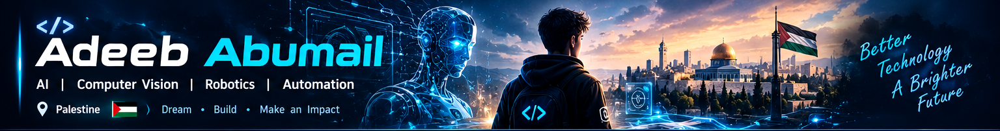
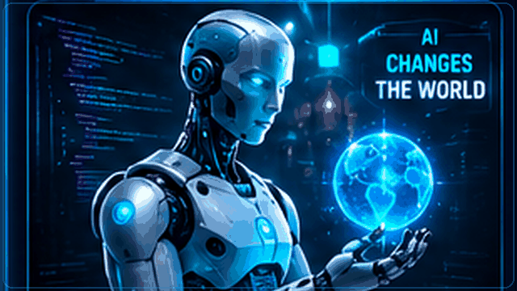
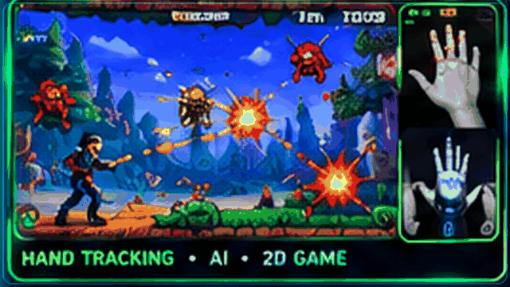
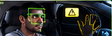
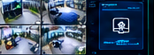
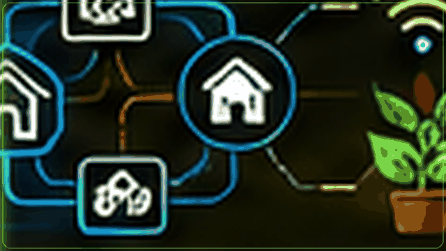

  
   
  <h1>Hi, I'm Adeeb Abumail 👋</h1>
  <h3>Aspiring Developer · Palestine 🇵🇸</h3>
  
<b>AI · Machine Learning · Computer Vision · Robotics · Intelligent Automation</b>

  
<i>Turning curiosity into projects, one experiment at a time.</i>

  

---

## About Me

I'm an aspiring developer from Palestine who enjoys exploring how software and hardware can work together to solve practical problems. My interests span artificial intelligence, machine learning, computer vision, cybersecurity, robotics, mechatronics, electronics, programming, mathematics, and intelligent automation.

I learn by experimenting, building prototypes, testing ideas, and improving projects step by step. The project descriptions below distinguish work I have developed from prototypes and ideas that are still evolving.

## Technical Interests

- Artificial intelligence and machine learning
- Computer vision and gesture-based interaction
- Cybersecurity, networking, and Linux tools
- Robotics, mechatronics, and embedded systems
- Electronics, sensors, and intelligent automation
- Programming, mathematics, and problem solving

## Skills I'm Building

- Python programming and project integration
- Computer-vision experimentation with camera input and hand gestures
- Building local-network applications and interactive prototypes
- Debugging, testing, and improving software in stages
- Exploring electronics, sensors, and embedded-device workflows

*This is a learning-focused overview, not a claim of professional proficiency.*

## Technologies & Tools

*These are technologies I use, explore, or want to keep developing with—not a ranking of my proficiency.*

  
  
  
  
  
  
  
  
  
  
  
  
  
  
  
  
  

---

## Featured Project

### 🎮 AI & Computer Vision Hand-Controlled 2D Game

  

A 2D action game developed by Adeeb Abukmail as a school challenge, combining artificial intelligence and computer vision for gesture-based gameplay. It is also an AI and computer vision game involving shooting arrows and grenades at hostile targets while accumulating points.

**Gameplay controls and actions**

- Move the character using the **Arrow Keys** or **WASD**.
- Close the hand into a fist to fire **one projectile**.
- Raise the index finger to fire **five projectiles in different directions**.
- Bring both hands close together to launch a **powerful bomb attack**.
- Fight hostile targets, avoid enemy projectiles and collisions, and collect points.
- Use camera-based hand-gesture recognition for interactive gameplay.

**Status:** Developed as a school-challenge project. The artwork in this README is illustrative, not a screenshot of the running game.

---

## Other Technical Projects

<table>
  <tr>
    <td width="50%" valign="top">
      <h3>🚗 AI Driver Monitoring & Drowsiness Detection</h3>
      
      
<b>Status: Implemented prototype</b>

      A computer-vision safety project centered on monitoring eye state and triggering an audible warning when the eyes remain closed beyond a configurable threshold. The broader project direction includes head orientation, gaze direction, and possible phone-use cues.
    </td>
    <td width="50%" valign="top">
      <h3>📷 AI Camera Surveillance System</h3>
      
      
<b>Status: Prototype / in development</b>

      A camera-monitoring project exploring computer-vision detection, event-focused recording, and alerts through a local dashboard. The exact features depend on the current project build; this README does not claim that every planned module is complete.
    </td>
  </tr>
  <tr>
    <td width="50%" valign="top">
      <h3>📱 Wireless Phone-to-Laptop Communication</h3>
      
      
<b>Status: Prototype / in development</b>

      An experimental local-network project exploring permission-based phone-to-computer communication. Planned directions include user-approved camera or screen viewing, audio and commands, and user-selected file transfer.
    </td>
    <td width="50%" valign="top">
      <h3>🔌 Smart Automation & IoT Experiments</h3>
      
      
<b>Status: Experiments and ideas</b>

      Ongoing exploration of sensors, electronics, Arduino, ESP32, Raspberry Pi, and practical automation concepts. Individual ideas may still be at the research or prototyping stage.
    </td>
  </tr>
</table>

<i>All project illustrations are original AI-generated visual artwork used for presentation; they are not photographs or screenshots of physical prototypes.</i>

---

## Learning Goals

- Deepen my foundations in AI, machine learning, and computer vision.
- Build more reliable real-world applications and improve how I test them.
- Explore robotics, embedded systems, and mechatronics through hands-on experiments.
- Improve my understanding of cybersecurity and networking in ethical, authorized environments.
- Combine software, electronics, and automation into useful projects.
- Keep learning, documenting, and sharing what I build.

## Connect With Me

Replace these placeholders with your actual public links before publishing.

  
  
  
  

---

  
  
<b>Learn continuously · Build thoughtfully · Make technology useful</b>

  From Palestine 🇵🇸, with curiosity and a commitment to keep improving.

